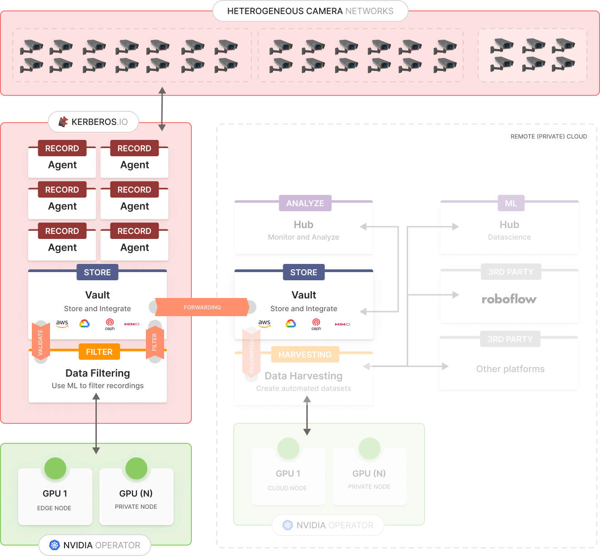

# Data filtering

Data filtering is an essential process in managing the vast amounts of video data generated by video cameras and CCTV systems. In environments where bandwidth and storage are limited, it is crucial to ensure that only relevant video recordings are forwarded to the cloud for further analysis and storage. This is where machine learning (ML) models become invaluable. By employing ML models, data filtering can be significantly enhanced to automatically assess and determine the importance of each video recording based on specific conditions or criteria. For example, an ML model can be trained to detect particular objects or events within the video footage, such as identifying the presence of at least five people or recognizing at least two trucks. When these predefined conditions are met, the recording is marked as relevant and subsequently forwarded to the cloud. This intelligent filtering mechanism not only optimizes the use of network resources but also ensures that critical video data is prioritized and available for real-time decision-making and analytics. Additionally, by reducing the volume of video data transmitted to the cloud, organizations can achieve cost savings on storage and processing while maintaining the integrity and relevance of their video streams. This approach enhances the efficiency and effectiveness of video surveillance systems, ensuring that only pertinent data is retained and analyzed.

As illustrated in the image above, recordings are collected from a heterogeneous landscape through Kerberos Agents and stored centrally in a local Kerberos Vault. Each stored recording triggers an integration with the data filtering service. This data filtering can involve any type of analysis algorithm, such as computer vision or machine learning models, to identify specific events and mark them as important. Once a recording is marked as important, the data filtering service instructs the local Kerberos Vault to forward the recording to a remote Kerberos Vault. By implementing this process, we achieve the following benefits:

- Reduced bandwidth usage by minimizing the number of recordings being forwarded
- Decreased cloud storage requirements due to fewer recordings being transmitted
- Enhanced relevance of recordings, as most irrelevant recordings are not forwarded
- Automated creation of datasets.

## Datascience
